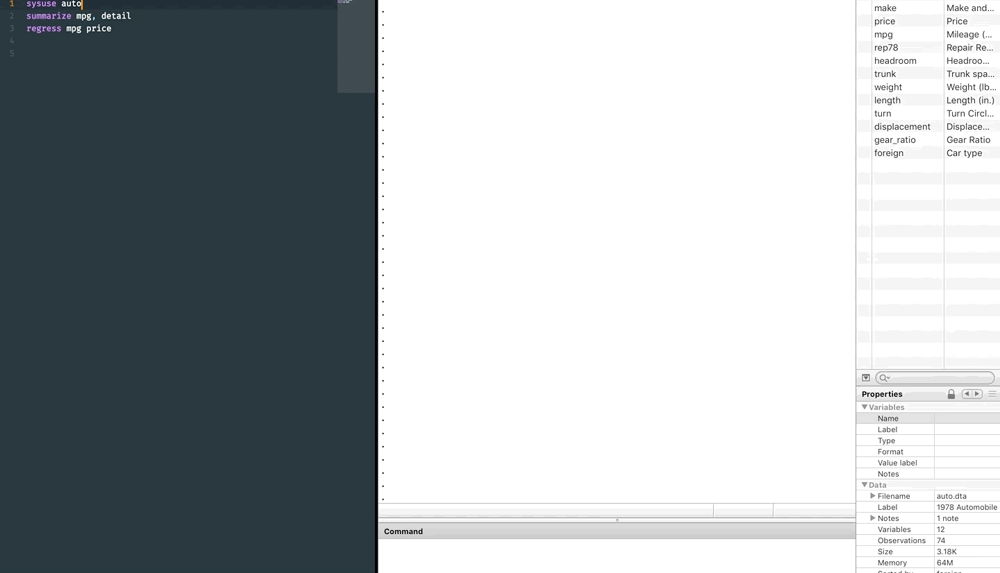

# stata-exec

Send code to Stata from [Atom](https://atom.io). _Note: This is for Mac and Linux only._ This was originally ported from the [r-exec](https://atom.io/packages/r-exec) package.



## News
- Version 1.1.0 includes the ability to run code in a session of Stata running on a remote server. See the configuration settings below for details.
- Version 1.2.0 adds support for Linux.

## Installation

In the terminal run `apm install stata-exec` or go to Settings > Install and search for `stata-exec`.

### Dependencies

This package depends on [`language-stata`](https://atom.io/packages/language-stata), which you will be prompted to install if needed. There are no additional dependencies needed for use on macOS.

#### Linux

Linux users must install [Autokey](https://github.com/autokey-py3/autokey). On Ubuntu, that's as simple as:
```
sudo add-apt-repository ppa:troxor/autokey
sudo apt update
sudo apt install autokey-gtk
```
You must then link the [stata-exec.py](./linux/stata-exec.py) file to your Autokey data directory. This is `~/.config/autokey/data/My Phrases` by default, so you can add the file to that directory with the command
```
ln -s ~/.atom/packages/stata-exec/linux/stata-exec.py ~/.config/autokey/data/My\ Phrases/
```
This only needs to be done once. (Creating a symlink ensures that the script is always the most up to date version.) Additionally, the autokey program must be running for code sending to work. To do this, open up a new terminal and run `autokey-gtk`; this process needs to be running each time you run code. (Alternatively, there's an option in Autokey's settings to start the program by default at login.)

## Usage

Code can be run using either the Command Palette or with keyboard shortcuts. _Important: If using macOS, you must first select the flavor of Stata you own. See configuration settings [below](#configuration)._

To open the Command Palette, press `cmd-shift-P`/`ctrl-shift-P`, and then start typing `Stata Exec`. The available commands will be shown in the drop-down menu.

The following are the default keyboard shortcuts (Mac/Linux). These can be personalized in your [`keymap.cson`](http://flight-manual.atom.io/behind-atom/sections/keymaps-in-depth/).
- `cmd-enter`/`ctrl-enter`: send selection or current line to Stata.
- `shift-cmd-D`/`shift-ctrl-D`: send entire file to Stata. (File must be saved first. This runs `do "/path/to/current/file"`)
- `shift-alt-P`/`ctrl-alt-p`: send the previous command.
- `shift-cmd-C`/`shift-ctrl-C`: change Stata's working directory to that of current file.
- `shift-cmd-G`/`shift-ctrl-G`: send paragraph under current cursor. A paragraph is a region enclosed by whitespace.
- `shift-cmd-R`/`shift-ctrl-R`: send program definition under current cursor. If there exists `program drop` on the line before `program define`, the line including the former will be included in the selection. For example, all the lines in the below snippet would be sent to Stata:

    ```stata
    cap program drop myProgram
    program define myProgram
        // program contents
    end
    ```

## Configuration

All configuration can be done in the settings panel (Settings > Packages > stata-exec). The available options are listed below:

- Which App
  - Select **StataIC**, **StataSE**, or **StataMP** depending on which version of Stata you have.
  - Select **XQuartz** if you want to run selections in session of Stata on a remote Unix server. To set this up, you need to have Stata already open in XQuartz; Atom will not open it for you. In your terminal, you'll need to do something like `ssh username@host -Y`, likely followed by `xstata`. This package's commands to run the entire do file and set the working directory are not supported on XQuartz.
  - This setting currently has no effect on Linux.
- Advance Position
  - If checked, move cursor to the next line/paragraph after running the current line/paragraph.
- Focus Window
  - If checked, bring the Stata window to focus when sending code.
  - Otherwise, code runs in the background and the screen remains focused on Atom.
- Notifications
  - If checked, a pop-up notification will appear when a paragraph or function is not identified.
- Skip Comments
  - If this and Advance Position are checked, after running a line the cursor will move to the next uncommented line.
- Paste Speed
  - This is only applicable for XQuartz. This value changes the amount of time the program waits between switching to the XQuartz window, pasting code, and sending "enter". The only way to send code to XQuartz is to use the clipboard, and the responsiveness of this process will depend on the speed of your internet connection. If the copy-pasting isn't working, try increasing the value. Decreasing the value will run your code faster. Value must be between 0.1 and 10.

## Notes

This package is currently only for Mac and Linux users. Interactive Windows support seems impossible, see issue [#4](https://github.com/kylebarron/stata-exec/issues/4).

### Troubleshooting and Known Issues
- _Do entire file_ doesn't run the last line of the do file.
  - Stata needs there to be a _newline_ character following the last line of text. Add an empty line to the end of the file and it'll work.

